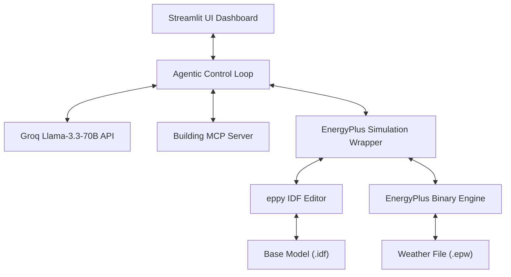

# System Architecture Document: Eco-Loop Building Agent
## 1. Executive Summary
### Eco-Loop is an autonomous, closed-loop building management system designed to optimize energy efficiency and thermal comfort in real time. By integrating building physics simulation (**EnergyPlus**) with Large Language Model decision-making (**Llama 3.3 70B** via **Groq**) through a standardized protocol layer (**Model Context Protocol / MCP**), Eco-Loop enables dynamic setpoint tuning without human intervention.
---
## 2. Architectural Overview
The system consists of four primary layers working synchronously in an iterative feedback loop:

3. Tool-Calling Architecture & MCP Integration

The platform uses Model Context Protocol (MCP) to decouple LLM cognitive reasoning from low-level system operations:

1. Tool Discovery: The agent discovers tools programmatically via mcp.list_tools().
2. Deterministic Execution: Tools execute explicit Python methods rather than allowing raw unconstrained code execution by the LLM.
3. Structured Telemetry Payload: MCP returns validated JSON responses containing zone temperature, energy consumption, and thermal comfort metrics.

Exposed MCP Tools:

- parse_simulation_errors: Scans EnergyPlus execution log streams.
- inspect_building_idf: Validates building structural configuration.
- execute_remediation_task: Logs and executes automated corrective actions.
- get_live_metrics: Streams continuous real-time building performance telemetry.

 ---

4. Prompt Engineering Strategies
- System Persona Framing: The system prompt grounds the AI model within a specific operational domain: "You are an autonomous AI Building Energy Agent connected via Model Context Protocol (MCP)."
- Strict JSON Schema Enforcement: Uses response_format={"type": "json_object"} in model completions to guarantee valid structured outputs:
  {
      "recommended_setpoint": 24.0,
      "reasoning": "Lowering setpoint slightly improves PMV thermal comfort index while maintaining energy efficiency."
  }
- Dynamic Context Grounding: Real-time telemetry values (Zone Temp, Energy Consumption, PMV Thermal Comfort) are injected directly into the user prompt window to prevent hallucinated decisions.

  ---

5. Prompt Latency Management
To ensure real-time closed-loop control responsiveness:
- LPU Hardware Acceleration: Employs llama-3.3-70b-versatile hosted on Groq LPU hardware, delivering sub-second completion latency.
- Deterministic Temperature Tuning: Configured with temperature=0.3 to minimize token sampling variance and ensure consistent setpoint recommendations.
- Optimized Token Footprint: Filters out redundant metadata to keep prompt payloads minimal, avoiding high latency during multi-step optimization loops.

---
