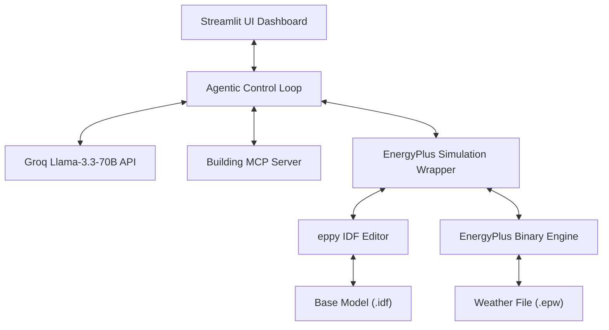

# System Architecture Document: Eco-Loop Building Agent
## 1. Executive Summary
### Eco-Loop is an autonomous, closed-loop building management system designed to optimize energy efficiency and thermal comfort in real time. By integrating building physics simulation (**EnergyPlus**) with Large Language Model decision-making (**Llama 3.3 70B** via **Groq**) through a standardized protocol layer (**Model Context Protocol / MCP**), Eco-Loop enables dynamic setpoint tuning without human intervention.
---
## 2. Architectural Overview
The system consists of four primary layers working synchronously in an iterative feedback loop:

3. Tool-Calling Architecture & MCP Integration

The platform uses Model Context Protocol (MCP) to decouple LLM cognitive reasoning from low-level system operations:

1. Tool Discovery: The agent discovers tools programmatically via mcp.list_tools().
2. Deterministic Execution: Tools execute explicit Python methods rather than allowing raw unconstrained code execution by the LLM.
3. Structured Telemetry Payload: MCP returns validated JSON responses containing zone temperature, energy consumption, and thermal comfort metrics.

Exposed MCP Tools:

- parse_simulation_errors: Scans EnergyPlus execution log streams.
- inspect_building_idf: Validates building structural configuration.
- execute_remediation_task: Logs and executes automated corrective actions.
- get_live_metrics: Streams continuous real-time building performance telemetry.

 ---

4. Prompt Engineering Strategies
- System Persona Framing: The system prompt grounds the AI model within a specific operational domain: "You are an autonomous AI Building Energy Agent connected via Model Context Protocol (MCP)."
- Strict JSON Schema Enforcement: Uses response_format={"type": "json_object"} in model completions to guarantee valid structured outputs:
  {
      "recommended_setpoint": 24.0,
      "reasoning": "Lowering setpoint slightly improves PMV thermal comfort index while maintaining energy efficiency."
  }
- Dynamic Context Grounding: Real-time telemetry values (Zone Temp, Energy Consumption, PMV Thermal Comfort) are injected directly into the user prompt window to prevent hallucinated decisions.

  ---

5. Prompt Latency Management
To ensure real-time closed-loop control responsiveness:
- LPU Hardware Acceleration: Employs llama-3.3-70b-versatile hosted on Groq LPU hardware, delivering sub-second completion latency.
- Deterministic Temperature Tuning: Configured with temperature=0.3 to minimize token sampling variance and ensure consistent setpoint recommendations.
- Optimized Token Footprint: Filters out redundant metadata to keep prompt payloads minimal, avoiding high latency during multi-step optimization loops.

---

6. Technical Approach to Handling Lengthy Simulation Logs
EnergyPlus output error files (eplusout.err) can contain thousands of lines of verbose diagnostic outputs. To manage log complexity:

Keyword Filtering: The parse_simulation_errors tool scans the log line-by-line, isolating entries with keywords Severe, Fatal, or Warning.
Top Issue Truncation: Filters out repetitive diagnostic output and extracts only the top 5 critical issue lines to fit context window limits.
Syntax Fallback Checks: If simulation log generation is pending, an automated fallback syntax validation executes to prevent pipeline interruption.

---

7. Closed-Loop Execution Sequence

<svg xmlns="http://www.w3.org/2000/svg" viewBox="0 0 863.983 708" width="863.983" height="708" style="--bg:#1F1F1F;--fg:#CCCCCC;--line:#CCCCCC;--accent:#0078D4;--muted:#CCCCCCCC;--surface:#181818;--border:#CCCCCC;background:var(--bg)">

<defs>
  <marker id="seq-arrow" markerWidth="8" markerHeight="5" refX="8" refY="2.5" orient="auto-start-reverse">
    <polygon points="0 0, 8 2.5, 0 5" fill="var(--_arrow)" />
  </marker>
  <marker id="seq-arrow-open" markerWidth="8" markerHeight="5" refX="8" refY="2.5" orient="auto-start-reverse">
    <polyline points="0 0, 8 2.5, 0 5" fill="none" stroke="var(--_arrow)" stroke-width="1" />
  </marker>
</defs>
<g class="block" data-type="loop" data-label="Optimization Loop (Steps 1 to N)">
  <rect x="30" y="358" width="803.983" height="300" rx="0" ry="0" fill="none" stroke="var(--_node-stroke)" stroke-width="1" />
  <rect x="30" y="358" width="205.08999999999997" height="18" fill="var(--_group-hdr)" stroke="var(--_node-stroke)" stroke-width="1" />
  <text x="36" y="367" font-size="11" font-weight="600" fill="var(--_text-sec)" dy="3.8499999999999996">loop [Optimization Loop (Steps 1 to N)]</text>
</g>
<line class="lifeline" data-actor="Sim" x1="114.4025" y1="70" x2="114.4025" y2="678" stroke="var(--_line)" stroke-width="0.75" stroke-dasharray="6 4" />
<line class="lifeline" data-actor="Wrapper" x1="302.837" y1="70" x2="302.837" y2="678" stroke="var(--_line)" stroke-width="0.75" stroke-dasharray="6 4" />
<line class="lifeline" data-actor="MCP" x1="470.894" y1="70" x2="470.894" y2="678" stroke="var(--_line)" stroke-width="0.75" stroke-dasharray="6 4" />
<line class="lifeline" data-actor="Agent" x1="615.6095" y1="70" x2="615.6095" y2="678" stroke="var(--_line)" stroke-width="0.75" stroke-dasharray="6 4" />
<line class="lifeline" data-actor="LLM" x1="765.1415" y1="70" x2="765.1415" y2="678" stroke="var(--_line)" stroke-width="0.75" stroke-dasharray="6 4" />
<g class="message" data-from="Agent" data-to="Wrapper" data-label="Run Initial EnergyPlus Simulation" data-line-style="solid" data-arrow-head="filled" data-self="false">
  <line x1="615.6095" y1="90" x2="302.837" y2="90" stroke="var(--_line)" stroke-width="1" marker-end="url(#seq-arrow)" />
  <text x="459.22325" y="80" font-size="11" text-anchor="middle" font-weight="400" fill="var(--_text-muted)" dy="3.8499999999999996">Run Initial EnergyPlus Simulation</text>
</g>
<g class="message" data-from="Wrapper" data-to="Sim" data-label="Execute binary with IDF &amp; EPW" data-line-style="solid" data-arrow-head="filled" data-self="false">
  <line x1="302.837" y1="130" x2="114.4025" y2="130" stroke="var(--_line)" stroke-width="1" marker-end="url(#seq-arrow)" />
  <text x="208.61975" y="120" font-size="11" text-anchor="middle" font-weight="400" fill="var(--_text-muted)" dy="3.8499999999999996">Execute binary with IDF &amp; EPW</text>
</g>
<g class="message" data-from="Sim" data-to="Wrapper" data-label="Simulation Completed" data-line-style="dashed" data-arrow-head="filled" data-self="false">
  <line x1="114.4025" y1="170" x2="302.837" y2="170" stroke="var(--_line)" stroke-width="1" stroke-dasharray="6 4" marker-end="url(#seq-arrow)" />
  <text x="208.61975" y="160" font-size="11" text-anchor="middle" font-weight="400" fill="var(--_text-muted)" dy="3.8499999999999996">Simulation Completed</text>
</g>
<g class="message" data-from="Agent" data-to="MCP" data-label="Query Available Tools" data-line-style="solid" data-arrow-head="filled" data-self="false">
  <line x1="615.6095" y1="210" x2="470.894" y2="210" stroke="var(--_line)" stroke-width="1" marker-end="url(#seq-arrow)" />
  <text x="543.25175" y="200" font-size="11" text-anchor="middle" font-weight="400" fill="var(--_text-muted)" dy="3.8499999999999996">Query Available Tools</text>
</g>
<g class="message" data-from="MCP" data-to="Agent" data-label="Tool List Exposed" data-line-style="dashed" data-arrow-head="filled" data-self="false">
  <line x1="470.894" y1="250" x2="615.6095" y2="250" stroke="var(--_line)" stroke-width="1" stroke-dasharray="6 4" marker-end="url(#seq-arrow)" />
  <text x="543.25175" y="240" font-size="11" text-anchor="middle" font-weight="400" fill="var(--_text-muted)" dy="3.8499999999999996">Tool List Exposed</text>
</g>
<g class="message" data-from="Agent" data-to="MCP" data-label="Call parse_simulation_errors" data-line-style="solid" data-arrow-head="filled" data-self="false">
  <line x1="615.6095" y1="290" x2="470.894" y2="290" stroke="var(--_line)" stroke-width="1" marker-end="url(#seq-arrow)" />
  <text x="543.25175" y="280" font-size="11" text-anchor="middle" font-weight="400" fill="var(--_text-muted)" dy="3.8499999999999996">Call parse_simulation_errors</text>
</g>
<g class="message" data-from="MCP" data-to="Agent" data-label="System Health Status" data-line-style="dashed" data-arrow-head="filled" data-self="false">
  <line x1="470.894" y1="330" x2="615.6095" y2="330" stroke="var(--_line)" stroke-width="1" stroke-dasharray="6 4" marker-end="url(#seq-arrow)" />
  <text x="543.25175" y="320" font-size="11" text-anchor="middle" font-weight="400" fill="var(--_text-muted)" dy="3.8499999999999996">System Health Status</text>
</g>
<g class="message" data-from="Agent" data-to="MCP" data-label="Call get_live_metrics" data-line-style="solid" data-arrow-head="filled" data-self="false">
  <line x1="615.6095" y1="398" x2="470.894" y2="398" stroke="var(--_line)" stroke-width="1" marker-end="url(#seq-arrow)" />
  <text x="543.25175" y="388" font-size="11" text-anchor="middle" font-weight="400" fill="var(--_text-muted)" dy="3.8499999999999996">Call get_live_metrics</text>
</g>
<g class="message" data-from="MCP" data-to="Agent" data-label="Live Telemetry (Temp, Energy, PMV)" data-line-style="dashed" data-arrow-head="filled" data-self="false">
  <line x1="470.894" y1="438" x2="615.6095" y2="438" stroke="var(--_line)" stroke-width="1" stroke-dasharray="6 4" marker-end="url(#seq-arrow)" />
  <text x="543.25175" y="428" font-size="11" text-anchor="middle" font-weight="400" fill="var(--_text-muted)" dy="3.8499999999999996">Live Telemetry (Temp, Energy, PMV)</text>
</g>
<g class="message" data-from="Agent" data-to="LLM" data-label="Send Context &amp; Telemetry Prompt" data-line-style="solid" data-arrow-head="filled" data-self="false">
  <line x1="615.6095" y1="478" x2="765.1415" y2="478" stroke="var(--_line)" stroke-width="1" marker-end="url(#seq-arrow)" />
  <text x="690.3755" y="468" font-size="11" text-anchor="middle" font-weight="400" fill="var(--_text-muted)" dy="3.8499999999999996">Send Context &amp; Telemetry Prompt</text>
</g>
<g class="message" data-from="LLM" data-to="Agent" data-label="Optimal Setpoint &amp; Reasoning (JSON)" data-line-style="dashed" data-arrow-head="filled" data-self="false">
  <line x1="765.1415" y1="518" x2="615.6095" y2="518" stroke="var(--_line)" stroke-width="1" stroke-dasharray="6 4" marker-end="url(#seq-arrow)" />
  <text x="690.3755" y="508" font-size="11" text-anchor="middle" font-weight="400" fill="var(--_text-muted)" dy="3.8499999999999996">Optimal Setpoint &amp; Reasoning (JSON)</text>
</g>
<g class="message" data-from="Agent" data-to="Wrapper" data-label="Forward Inject Setpoint Update" data-line-style="solid" data-arrow-head="filled" data-self="false">
  <line x1="615.6095" y1="558" x2="302.837" y2="558" stroke="var(--_line)" stroke-width="1" marker-end="url(#seq-arrow)" />
  <text x="459.22325" y="548" font-size="11" text-anchor="middle" font-weight="400" fill="var(--_text-muted)" dy="3.8499999999999996">Forward Inject Setpoint Update</text>
</g>
<g class="message" data-from="Wrapper" data-to="Sim" data-label="Modify IDF thermostat via eppy &amp; Save Step IDF" data-line-style="solid" data-arrow-head="filled" data-self="false">
  <line x1="302.837" y1="598" x2="114.4025" y2="598" stroke="var(--_line)" stroke-width="1" marker-end="url(#seq-arrow)" />
  <text x="208.61975" y="588" font-size="11" text-anchor="middle" font-weight="400" fill="var(--_text-muted)" dy="3.8499999999999996">Modify IDF thermostat via eppy &amp; Save Step IDF</text>
</g>
<g class="message" data-from="Agent" data-to="MCP" data-label="Execute Remediation Task Record" data-line-style="solid" data-arrow-head="filled" data-self="false">
  <line x1="615.6095" y1="638" x2="470.894" y2="638" stroke="var(--_line)" stroke-width="1" marker-end="url(#seq-arrow)" />
  <text x="543.25175" y="628" font-size="11" text-anchor="middle" font-weight="400" fill="var(--_text-muted)" dy="3.8499999999999996">Execute Remediation Task Record</text>
</g>
<g class="actor" data-id="Sim" data-label="EnergyPlus Engine" data-type="participant">
  <rect x="40" y="30" width="148.805" height="40" rx="4" ry="4" fill="var(--_node-fill)" stroke="var(--_node-stroke)" stroke-width="1" />
  <text x="114.4025" y="50" font-size="13" text-anchor="middle" font-weight="500" fill="var(--_text)" dy="4.55">EnergyPlus Engine</text>
</g>
<g class="actor" data-id="Wrapper" data-label="Simulation Wrapper" data-type="participant">
  <rect x="228.80499999999998" y="30" width="148.06400000000002" height="40" rx="4" ry="4" fill="var(--_node-fill)" stroke="var(--_node-stroke)" stroke-width="1" />
  <text x="302.837" y="50" font-size="13" text-anchor="middle" font-weight="500" fill="var(--_text)" dy="4.55">Simulation Wrapper</text>
</g>
<g class="actor" data-id="MCP" data-label="MCP Server" data-type="participant">
  <rect x="416.869" y="30" width="108.05" height="40" rx="4" ry="4" fill="var(--_node-fill)" stroke="var(--_node-stroke)" stroke-width="1" />
  <text x="470.894" y="50" font-size="13" text-anchor="middle" font-weight="500" fill="var(--_text)" dy="4.55">MCP Server</text>
</g>
<g class="actor" data-id="Agent" data-label="Agent Loop" data-type="participant">
  <rect x="564.919" y="30" width="101.381" height="40" rx="4" ry="4" fill="var(--_node-fill)" stroke="var(--_node-stroke)" stroke-width="1" />
  <text x="615.6095" y="50" font-size="13" text-anchor="middle" font-weight="500" fill="var(--_text)" dy="4.55">Agent Loop</text>
</g>
<g class="actor" data-id="LLM" data-label="Llama 3 Model" data-type="participant">
  <rect x="706.3" y="30" width="117.68299999999998" height="40" rx="4" ry="4" fill="var(--_node-fill)" stroke="var(--_node-stroke)" stroke-width="1" />
  <text x="765.1415" y="50" font-size="13" text-anchor="middle" font-weight="500" fill="var(--_text)" dy="4.55">Llama 3 Model</text>
</g>
</svg>
